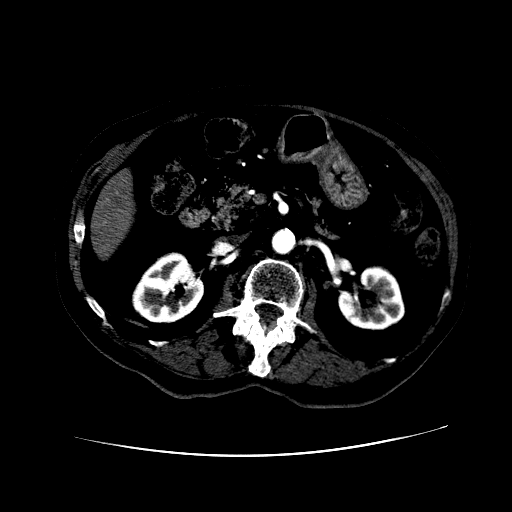
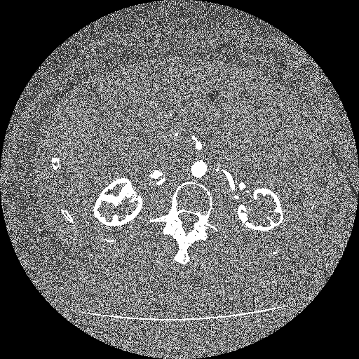
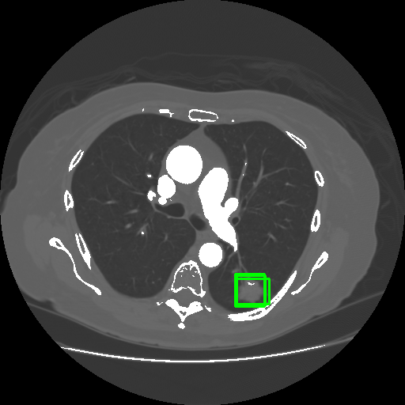

# BUILD A WELL STURCUTRED SYSTEM TO DETECT 肺部结节 BASE ON THE CT IMAGE -- NORTHEAST UNIVERSITY ShAn_3003
## THOUGHT AND STEP
### Step01 数据预处理
1. 数据整理：将对应的dcmi图片和对应的xml文件路径写入csv文件中方便下一步处理：generate_csv.ipynb  （为什么1号病人的study1里面的00000文件夹下面的dcmi这么少，也没有68.xml对应的dcmi）
2. dcmi文件处理：后续需要学习一下dcmi文件如何转化到jpg图片（不同公司的窗宽、窗位不同）preprocess_dcmi.ipynb *发现采用了窗宽窗位优化效果不好，在0001号数据集上，直接对应变换更好*
3. dcmi Problem:使用simpleITK和pydicom读出来的图片可视化之后效果不同，应该选择哪种

<div style="display: flex; justify-content: space-between;">
  
  
  
</div>

****
```python
def linear_reflect(dcm_array,dcm_data):
  slope = dcm_data.RescaleSlope
  intercept = dcm_data.RescaleIntercept
  
  # set wc and ww by self wc(-450~-600) ww(1500,2000)
  wc = dcm_data.WindowCenter
  ww = dcm_data.WindowWidth

  lowest = wc-ww/2
  highest = wc+ww/2

  
  dcm_array = dcm_array*slope+intercept
  
  normalized_array = (dcm_array-dcm_array.min())/(dcm_array.max()-dcm_array.min())
  
  lowest = (lowest-dcm_array.min())/(dcm_array.max()-dcm_array.min())
  highest = (highest-dcm_array.min())/(dcm_array.max()-dcm_array.min())
  
  # Directly set values outside the window to 0 (or desired background value)
  normalized_array[normalized_array < lowest] = 0  # Set to black
  normalized_array[normalized_array > highest] = 1  # Set to white (or desired max value)
  
  normalized_array = normalized_array*255
  
  return normalized_array
```

  

****
* 自己理解：  
ct扫描出来的图像数据在-1024-32768 而dicom文件存储一般用12位 所以要得到原始的ct数据，需要做一个线性变换来得到原始数据 即HU值  
对于HU值，由于我们只关注肺部组织反映出来的HU值，所以将肺部组织之外的HU值设置为0
* Gemini:  
In DICOM (Digital Imaging and Communications in Medicine) images, the attributes Slope, Intercept, WindowWidth, and WindowCenter play crucial roles in accurately displaying and interpreting the image data. Let's delve into their specific functions:
  1. Slope (RescaleSlope):  
      The Slope attribute, also known as RescaleSlope, represents the factor by which the pixel values in the DICOM image need to be multiplied to obtain the actual physical values. It's analogous to the slope of a linear relationship between the pixel values and the corresponding physical quantities.  

      For instance, in a CT scan, the pixel values might represent Hounsfield Units (HU), which indicate the tissue density. The Slope value would then translate these pixel values into the actual HU values.

  2. Intercept (RescaleIntercept):  
      The Intercept attribute, also known as RescaleIntercept, represents the constant value that needs to be added to the pixel values after multiplying them by the Slope. It acts as a baseline or offset for the pixel intensities.  

      Continuing with the CT scan example, the Intercept would adjust the HU values to ensure they fall within the appropriate range for displaying the image correctly.  

  3. WindowWidth (WindowWidth):  
      The WindowWidth attribute specifies the width of the grayscale window used to display the DICOM image. It determines the range of pixel values that will be mapped to the full range of display values (typically 0-255 for grayscale images).  

      A narrower WindowWidth will focus on a smaller range of pixel values, highlighting subtle variations within that range. Conversely, a wider WindowWidth will encompass a broader range of pixel values, providing a more general view of the image.    
  4. WindowCenter (WindowCenter):   
      The WindowCenter attribute defines the center of the grayscale window used for display. It determines the midpoint of the pixel value range that will be mapped to the full range of display values.  

      A higher WindowCenter will shift the window towards brighter pixel values, while a lower WindowCenter will shift it towards darker values. This allows for adjusting the display to emphasize specific features or structures within the image.     
      
  In summary, the Slope, Intercept, WindowWidth, and WindowCenter attributes work together to transform the raw pixel values in a DICOM image into a meaningful grayscale representation that can be accurately displayed and interpreted by medical professionals. They play a vital role in ensuring the correct visualization and analysis of medical imaging data.
****
****
* xml文件处理：对标注的结节区域转化成对应模型需要的数据格式（暂时针对yolo模型部署）最后还是得要本地部署（怎么解决这个问题）  
  在处理xml文件的过程中，注意到并不是一张dicom文件对应一个xml标注文件，而是一个系列对应一个标注文件，roi区域通过ImageSOP和ct文件对应，所以简单修改一下预处理步骤  

  1. 首先读取ct文件，从文件中获取sop号，保存在对应的csv里面 同一个系列里面的xml存同一个路径，对于一个系列里面只有10张以下的dcm直接不读取（定位系列）--Modify_generatefilecsv.ipynb
  2. 生成图片
  3. 采用按图索骥的方法，对每个SOP去xml文件中找对应的roi   

* another question in xml process : 对于同一张图片，不同的医生对同一个结节会重复标记，一张图片可能存在两个或者多个结节:*直接全部保存，不管是不是同一个结节的重复标记还是不同的结节*  
* Visualize the Nodules in Png file
*****
  <div style="display: flex; justify-content: space-between;">
  
  
  
</div>  
  
*****  

*****
* 数据增强与降采样处理  
  1. 删除数据
    1. 不存在肺结节：对于全部数据，由于很多图片并不存在肺结节，对于后续的检测操作来说，并没有用处
    2. 肺结节标注太小：对于肺结节标注过小（只有一个或者两个像素点是肺结节）这种情况也基本上无法检测出来
  2. 数据增强：对于剩余数据进行水平翻转，垂直翻转，旋转90、180、270度这三种操作

*****

* 数据分割
  生成对应的yolo格式的文件之后，将数据分成训练集验证集测试集

* 数据上传
  使用华为云服务器tesla v100 32G显存进行Yolov8m训练


### Step02: 选择合适的模型yolo深度学习模型

******
*****
### Step03: 暂时跳过步骤02，完成界面设计，采用C/S架构

### Step04: 形成良好的工作流
* 第一步：保存各类文件的绝对路径
* 第二步：将绝对路径转换成静态文件的路径
* 第三步：显示各类文件

*****
